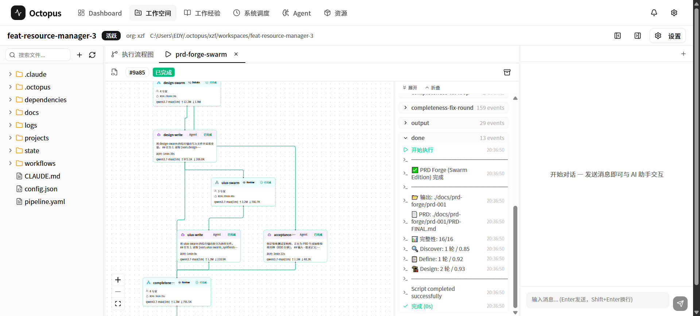
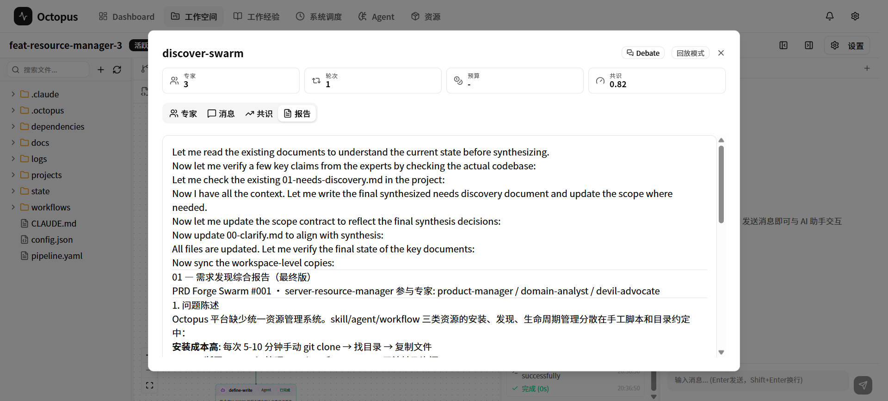
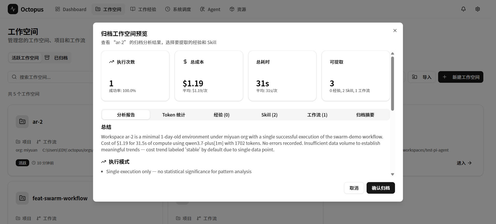

# Open Octopus -(之所以 Open 是因为觉得加了B格高)

[English](README_EN.md) | **中文**

> Agentic Workflow 编排 + 多项目隔离 + Agent/Skill 资产库 + 任务看板

> ⚠️ **开发阶段**：Octopus 目前仍处于积极开发中，许多功能正在完善和通用化。API 和工作流格式可能会变化。欢迎试用和反馈，但暂不建议用于生产环境。

> 💬 整个项目诞生于 vibe coding —— 从工作中遇到的一个个痛点出发，借助 AI 编程想办法解决，然后借鉴前辈的思路，按自己的理解一步步搭建出来。设计不够精巧，核心功能都是真实场景里逼出来的。希望能帮到同样在这条路上摸索的朋友。

## 简介

Octopus 的目标是一个 **Loop Engineering** 开发平台：让 AI Agent 在隔离的多项目环境中，通过可编排的工作流持续迭代 —— 项目自身也用 Octopus 迭代 Octopus。

核心理念：**Agent 不是工作流里的被动节点，而是一等公民** —— 可自主决策、动态生成子工作流、触发多 Agent 协作，并在安全守护下 24/7 运转。系统形成「定义 → 调度 → 执行 → 守护 → 归档 → 进化」的自我迭代闭环。

- **Workflow Engine** — YAML DSL 声明式编排，12 种节点类型，依赖自动推导 DAG 并行；支持 Chain / DAG / Swarm / Dynamic 四种编排模式
- **Swarm 协作引擎** — review / debate / dispatch / dynamic / moa 五种策略，一个节点编排专家团协作
- **Harness 安全守护** — 检测 → 干预 → 委派三层，让无人值守真正敢开
- **Task Board + Scheduler** — 看板协作编写 Spec，确认后入队；按 cron 调度或手动触发，24/7 自循环
- **Workspace 隔离** — 多项目 git worktree 隔离，独立端口与数据库，并行不干扰
- **Agent Clone 分身** — 6 个内置系统分身各司其职 + 自定义分身，各自带人设、技能、记忆与 worktree，可版本化、可合并回主线
- **资产生态** — 集成 agency-agents-zh 266 个预置角色 + superpowers-zh 技能库，统一管理 Skill / Agent / Workflow 的安装、版本与依赖

---

## 技术栈

TypeScript 5.9 · Node.js 20 · pnpm Workspaces · Hono 4（REST + SSE + WebSocket）· Next.js 16 + React 19 · Claude Agent SDK + Pi Agent SDK · SQLite · XYFlow · Yjs · Monaco Editor · Zod · Vitest + Playwright

---

## 安装

```bash
git clone git@github.com:XzhiF/open-octopus.git
cd open-octopus
pnpm install
pnpm build
pnpm dev            # Web UI http://localhost:3000 · Server API http://localhost:3001
```

运行前请确认环境已具备：**Node.js ≥ 20**、**pnpm ≥ 9**、**Git**（worktree 隔离依赖）、**Claude Code / Pi**（AI 执行引擎）。`gh`（GitHub CLI）用于仓库与 PR 操作，Hermes 用于通知推送，二者可选。

> 🚧 安装体验正在做两件事，届时上面这几步都会被取代：
> 1. **初始化安装向导** —— 首次启动进入 Web UI 引导页，选组织、填项目清单、装依赖资源，全程点击完成
> 2. **Agent 友好的安装文档** —— 一份可直接交给 Claude Code 执行的安装说明，`把这份文档跑起来` 即可完成部署与初始化

---

## 快速开始

打开 http://localhost:3000：

1. **初始化组织** — 首次使用需准备 `~/.octopus/orgs/<org>/repos/manifest.md` 项目清单（当前由 `octopus setup` + `octopus repos sync` 完成，安装向导落地后一步替代）
2. **创建工作空间** — 进入 Workspace，点击「新建」，选择项目与分支；每个工作空间独占一个 git worktree、端口与数据库
3. **编排工作流** — Monaco 编辑器写 YAML，XYFlow 画布看节点依赖；支持从内置工作流模板与资源库直接选用
4. **执行与观测** — 点击运行，实时查看节点状态、专家讨论、日志、Token / 成本消耗；异常由 Harness 拦截并推送
5. **任务看板** — 在 Task Board 与 Agent 对话共建 Spec（目标 / 验收标准 / 绑定工作流），确认后入队，由 Scheduler 分发执行
6. **沉淀与复用** — 执行完成自动归档为知识，按 scope 注入后续工作流；Skill / Agent / Workflow 在资源库统一管理

<p align="center">

</p>

---

## 项目架构

```
octopus/
├── packages/
│   ├── shared/          ← @octopus/shared (Zod schemas + VarPool + Harness 契约 + config)
│   ├── providers/       ← @octopus/providers (Claude SDK + Pi SDK 双引擎 + Token/成本追踪)
│   ├── cli/             ← octopus (Commander.js CLI)
│   ├── engine/          ← @octopus/engine (12 执行器 + WorkflowEngine + Harness + Checkpoint)
│   ├── server/          ← @octopus/server (Hono REST + SSE + WebSocket/Yjs + Actuator)
│   ├── web-app/         ← @octopus/web-app (Next.js 16 + React 19 前端)
│   └── core-pack/       ← @octopus/core-pack (skills / agents / workflow 模板)
├── scripts/             ← 开发工具 (dev.mjs, prod.mjs, branch-port.mjs)
├── pnpm-workspace.yaml
└── CLAUDE.md
```

```
包依赖：
shared ← providers ← engine ← cli / server
shared ← cli / server / web-app
core-pack ← cli / server
```

---

## 特色功能

### Workflow Engine — 12 种节点类型

| 执行器 | 说明 |
|--------|------|
| **bash / python** | 执行 shell 命令、Python 脚本 |
| **agent** | 调用 AI Agent，支持子代理委派、Skills 加载（Claude SDK / Pi SDK 双引擎） |
| **octopus_agent** | 平台原生 Agent 节点，可访问 Octopus 自身的工具与资源 |
| **interaction** | 人机交互节点，对话式澄清与确认 |
| **condition** | 条件分支 |
| **approval** | 人工审批（支持 Auto Answers 无人值守） |
| **loop** | 循环迭代，Checkpoint 中断恢复 |
| **swarm** | 多智能体协作（5 种策略） |
| **sub_workflow** | 嵌套子工作流 |
| **dynamic_sub_workflow** | LLM 运行时动态生成子 DAG |
| **task_dispatch** | 组合任务派发，向 Task Board 投递子任务 |

依赖自动推导为 DAG 并行调度；生命周期钩子在失败 / 预算超限时唤起 Agent 自动处置；资源声明式预装，工作流即装即用。

```yaml
# 变量系统：$vars.xxx 全局池 · $node-id.output.xxx 前序节点 · $last_output · $iteration
```

### Swarm — 5 种协作策略

一个 YAML 节点即可编排多个 AI 专家协作：

| 模式 | 说明 | 适用场景 |
|------|------|---------|
| **review** | 各专家并行一次，Host 综合 | 代码审查、安全审计 |
| **debate** | 多轮讨论 + 共识检测提前终止；滑动窗口上下文 + 旧轮压缩摘要 + Token 预算安全阀 | 技术决策、方案比选 |
| **dispatch** | DAG 依赖调度（Kahn 拓扑排序 + 循环依赖检测），层内并行、层间串行，依赖失败跳过下游 | 功能实现、多步协作 |
| **swarm** | SwarmRouter 两阶段路由：关键词预筛 → LLM 选 2–5 专家并决定协作模式 | 智能路由、开放话题 |
| **moa** | 全专家 fan-out → Aggregator 聚合，支持模型降级链 | 高质量产出、多视角融合 |

```yaml
# 示例：3 专家辩论技术选型
- id: decision
  type: swarm
  topic: "TypeScript vs Go，15 人团队后端 API 服务选型"
  mode: debate
  rounds: 3
  consensus_threshold: 0.7
  experts:
    - role: typescript-advocate
      prompt: "论证 TypeScript/Node.js 的优势"
    - role: go-advocate
      prompt: "论证 Go 的优势"
    - role: platform-engineer
      prompt: "从中立角度评估工程实际影响"
```

### Harness — 3 层安全守护

无人值守的前提是出问题时有人兜底。Harness 挂在执行链路上，异常不再靠人盯：

```
检测（5 种异常检测器）
  deterministic_error · stupid_retry · model_mismatch · process_conflict · timeout_cascade
    ↓
干预（5 种动作）
  inject_message 提示纠偏 · retry_with_hint 换路重试 · switch_model 切换模型
  pause 暂停通知 · abort 阻断保护宿主
    ↓
委派
  复杂场景交给 Harness Agent 分析处置，无法自愈则阻断并告警
```

Host Safety 侧另有 ToolInterceptor 拦截危险工具调用，配合进程组隔离、端口 / PID 保护，避免子进程误杀宿主。策略可在 System 面板按工作空间覆盖。

### Task Board + Scheduler

- **Task Board** — Kanban 看板，用户与 Agent 对话共建 Spec（目标 / 验收标准 / 绑定工作流 / 子单元拆解），确认后入队；工作流视图跟踪每个任务的执行进展
- **工作流绑定体系** — Preset catalog 把任务类型映射到工作流模板 + `input_values` 填充，必填项入队前校验
- **SchedulerEngine** — 扫描 Claim 分发，支持 Simple（直接执行）与 Composite（coordinator 派发子任务）两种模式，cron 定时 + 执行历史 + 审计日志

### 分身系统 — Agent Clone

工作流节点是「事」，分身是「人」。一个分身 = 人设（persona.md）+ 技能 + 独立记忆 + 专属 git worktree + 模型配置，是可以长期养成的角色：

| 内置系统分身 | 职责 | 记忆 |
|------|------|------|
| **workspace** 全栈开发助手 | 读写项目文件、构建测试部署、代码审查 | shared |
| **scheduler** 定时任务管理 | cron 任务创建、状态监控、异常重试、执行报告 | isolated |
| **archive** 工程分析师 | 执行归档、经验提取与结构化分析 | shared |
| **resource** 资源操作专家 | Skill / Agent / Workflow 的检索、安装与依赖处理 | isolated |
| **harness-agent** 工作流安全守护 | 接手 Harness 委派过来的复杂异常，分析后处置或阻断 | isolated |
| **task-author** 任务规格作者 | 在 Task Board 与用户对话，把模糊需求写成可调度 Spec | isolated |

- **自定义分身** — 创建向导定义人设、技能集、模型与工具；persona 与资源文件在 Monaco 面板在线编辑（自动保存），内置分身同样可以改
- **隔离执行** — 每个分身绑定独立 worktree 与分支，记忆按 shared / isolated 作用域读写，多分身并行不互相踩
- **版本管理** — semver `major.minor.patch[-alpha|beta|rc|stable]` 发布快照，DB + 文件系统双写并带补偿事务；版本间可 diff（人设 / 配置 / 技能增删）并一键回滚
- **结果合并** — 分身的产出经合并对话框评审后回流主线，合并内容作为 `clone_merge` 来源进知识库
- **双路径调用** — 主 Agent 走 CLI/API 统一入口由 LLM 工具委派分身（无需预先接线），Web UI 可直连分身会话（零路由延迟）；工作流里则由 `octopus_agent` 节点直接派活给指定分身

### Workspace 多项目隔离

三种完全隔离的运行模式，可同时开着：

| 模式 | 命令 | Server | Web | 数据库 | 场景 |
|------|------|--------|-----|--------|------|
| **dev (主仓库)** | `pnpm dev` | 3001 | 3000 | `octopus.db` | 日常开发 |
| **dev (worktree)** | `pnpm dev` | hash | +1 | `octopus-{branch}.db` | 并行分支 |
| **prod** | `pnpm prod` | 3099 | 3098 | `octopus-prod.db` | 用 Octopus 迭代自身 |

每个工作空间 = 独立 git worktree + pipeline.yaml + skills/agents 配置 + Checkpoint + 日志。可手动创建，也可由 Scheduler 每次从 ProjectSpec 重建干净环境，并自动生成指令文件与预置资源。

### 无人值守运行

- **Auto Answers** — 全局 + 节点级预设答案，AI 遇到确认时自动回答
- **Notify 子系统** — 节点进度、预算告警、执行失败、Harness 干预等事件统一经 Hermes 推送（Telegram/Slack/Webhook），按 severity 分级
- **Hooks** — `on_workflow_failure` / `on_complete` / `on_node_success` 等生命周期钩子，可在失败时唤起 Agent 自愈
- **Checkpoint** — 节点级 / 层级 / 批次级状态保存 + TTL，中断后可恢复
- **Budget** — Token / 成本（USD）/ 时间统一口径追踪，超阈触发钩子与告警

### 资产与记忆

- **Resource** — 统一管理 Skill / Agent / Workflow 的安装、版本与依赖；工作流声明所需资源，执行时智能绑定、按需加载、自动解析
- **Knowledge 经验库** — 执行与对话自动抽取经验条目（rule / skill）→ 审核入库 → 冲突消解 → 按 scope 注入 → 命中效果回流（完整知识库是其后续的大版本升级，见「演变过程」）
- **Agent Memory** — 会话摘要 + FTS 检索，按分身与时间归档，供分身与 Orchestrator 回查
- **SystemPromptAssembler** — 7 级优先级拼装 + 预算截断，保证上下文用在刀刃上

---

## 开发

```bash
pnpm install                # 安装依赖
pnpm build                  # 构建所有包
pnpm dev                    # 启动开发环境（自动识别主仓库 / worktree）
pnpm prod                   # 生产模式（完全隔离）
pnpm port                   # 查看端口分配
pnpm test                   # 运行测试 (Vitest)
```

---

## 致谢

Octopus 借鉴了以下优秀项目的思路和实现：

- **[Archon](https://github.com/coleam00/Archon)** — 工作流编排的核心理念和部分基础实现。特别感谢作者 Cole Medin 的开源贡献。
- **[superpowers-zh](https://github.com/jnMetaCode/superpowers-zh)** — 中文增强技能框架，为 Octopus 提供了 20+ 开箱即用的 Skill。
- **[agency-agents-zh](https://github.com/jnMetaCode/agency-agents-zh)** — 中文 Agent 角色库，数百个预置角色供 Swarm Router 动态选择。
- **[Matt Pocock's skills](https://github.com/mattpocock/skills)** — 需求澄清 → spec → tickets → 实现的工程流程，本项目自身即按此演进。

感谢这些作者提供了这么好的开源项目。


---

## 演变过程

从一个痛点出发，一步步长出来的平台：

```
SKILL Helper
  └→ 目标：创建企业级 SKILL

Dev Workspace
  └→ 聚合多项目 Git Worktree 并行开发

Workflow
  └→ 长任务无人值守，多节点分工（Agent / SubAgent / Skills）

Agent Swarm
  └→ 专家团并行协作，效率倍增

Remote: Notify & Watch & Exec
  └→ 借助 Hermes + Telegram 实现通知、监控、远程执行

Scheduler
  └→ 自循环初步（bug-hunter / research-2-pr / idea-2-pr）

Orchestrator Agent
  └→ 全局 Agent + SKILL + 知识库 + 分身 + 记忆

Memory
  └→ Workspace 归档，工作流执行知识注入，Orchestrator Agent 自动 SKILL 提升

Resource
  └→ 统一管理 SKILL / Agent / Workflow 的安装、版本与依赖；
     运行工作流时智能绑定所需资源，按需加载、自动解析

Agent as First-class Node
  └→ octopus_agent 节点让平台 Agent 直接进工作流：自带工具、记忆与资源；
     interaction / task_dispatch 打通人机与任务派发，Chat 双向驱动执行

Knowledge 经验库
  └→ 以条目为单位的轻量沉淀：抽取 → 审核 → 冲突消解 → 注入 → 效果回流，
     来源已覆盖归档 / 对话 / 分身合并三类

Harness
  └→ 3 层安全守护：异常检测 → 智能干预 → Agent 委派，
     配 ToolInterceptor 与进程树隔离，让无人值守敢真正开起来

Workflow Observability
  └→ Actuator 运行时端点 + Token / 成本统一口径 + 错误追踪 + 执行监控

Task Board
  └→ 需求 → Spec（目标 / 验收标准 / 工作流绑定）→ 确认入队 → 调度执行 → 看板跟踪
```

**… 进行中 ↓**

```
任务看板疏通
  └→ 当前聚焦任务规范与执行模式：Spec 字段口径统一、验收标准可验证、
     工作流绑定与必填校验、Simple / Composite 两条执行路径跑顺跑通

安装与上手
  └→ 产品化补票：Web 初始化安装向导 + Agent 友好安装文档，
     把今天散在 CLI 与手改 manifest 里的准备动作收敛成一次可复制的上手
```

**… 规划 ↓**

```
第二大脑 · 完整知识库
  └→ 不是现在这种经验条目库，而是一次大版本升级：
     结构化的完整知识库 —— 跨项目、跨执行历史、跨对话统一编目与检索，
     带来源、时效、冲突与演化链，让每一次踩坑和决策都留得下来、
     找得回去、用得上，成为开发人真正的第二大脑

分身修炼所
  └→ 建在上面那个知识库之上 —— 有了可检索的积累，才谈得上修炼：
     给分身一个真正能「练」的地方，样本（领域题库 / 用例集）·
     评估（可复现的跑分与判定）· 量化数据（能力雷达与成长曲线）·
     修炼场地（隔离环境 + 可重跑用例），再配上按领域整理的功法秘籍
     （SKILL + 记忆 + 反例），让做特定任务的分身有场所、有教材、
     有分数可循地往进阶修炼

Sandbox
  └→ 面向 E2E 全链路的执行沙箱 —— 构建、启动、浏览器操作到结果断言自成闭环，
     不依赖外部部署，让每次交付都能真跑一遍验证

Hub-and-Spoke
  └→ 架构演变：配置集中管理，统筹调度，不再局限于单机
```

---

## 许可证

MIT License — 详见 [LICENSE](LICENSE) 文件。
