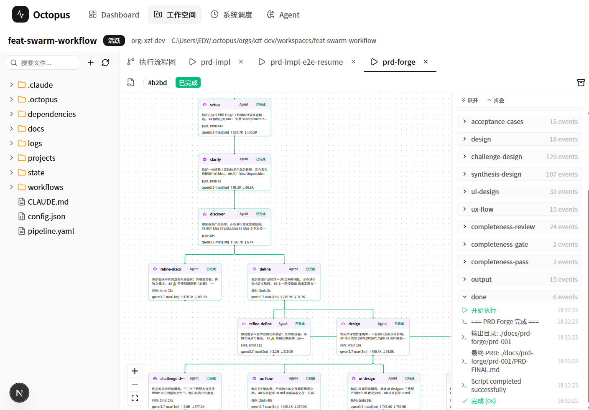
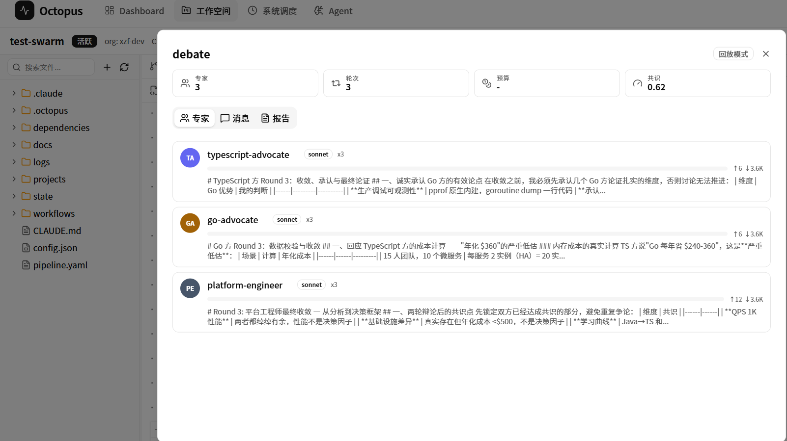

# Open Octopus -(Adding "Open" just makes it feel more legit)

**English** | [中文](README.md)

> AI Workflow Orchestration + Multi-Project Isolation + Agent/Skill Asset Management

> ⚠️ **Early Stage**: Octopus is under active development. Many features are being refined and generalized. APIs and workflow formats may change. Feedback is welcome, but not recommended for production use yet.

> 💬 This is the first open-source project seriously built by an unremarkable, average veteran programmer. The entire project was born from vibe coding — starting with real pain points at work, solving them with AI-assisted programming, borrowing ideas from those who came before, and building things step by step. The design may not be clever, but every core feature was forced into existence by real-world needs. Hope it helps others walking the same path.

## Introduction

Octopus aims to be a **Loop Engineering** development platform that enables AI Agents to continuously iterate within isolated multi-project environments through orchestratable workflows.

Core idea: **AI is not a one-shot tool — it's an engineering system that can run in continuous loops.**

- **Scheduler** — Workflows triggered by cron or manually, running 24/7
- **Orchestrator** — YAML-defined workflows with 7 executor types for complex task orchestration
- **Workflow Engine** — Chain invocation, DAG parallel scheduling, Swarm multi-agent collaboration, Dynamic routing
- **Agent Ecosystem** — Integrates 266 built-in roles from agency-agents-zh, supports custom roles, Swarm Router dynamically selects experts
- **Workspace Isolation** — Multi-project git worktree isolation, parallel without interference

---

## Prerequisites

| Tool | Purpose | Install |
|------|---------|---------|
| **Node.js** ≥ 20 | Runtime | https://nodejs.org |
| **pnpm** ≥ 9 | Package manager | `npm install -g pnpm` |
| **GitHub CLI** (`gh`) | Repository ops, PR management | https://cli.github.com |
| **Claude Code** | AI execution engine | https://docs.anthropic.com/en/docs/claude-code |
| **Hermes Agent** | Notification push (Telegram/Slack/Webhook) | — |
| **Git** | Version control + worktree | https://git-scm.com |

---

## Installation

```bash
# 1. Clone the repository
git clone git@github.com:XzhiF/octopus.git
cd octopus

# 2. Install dependencies + build
pnpm install
pnpm build

# 3. Register global command (symlink, recommended for development)

# Linux / macOS
ln -sf $(pwd)/packages/cli/dist/index.js /usr/local/bin/octopus

# Windows (Admin PowerShell)
New-Item -ItemType SymbolicLink -Path "$env:USERPROFILE\AppData\Local\Microsoft\WindowsApps\octopus" -Target "$PWD\packages\cli\dist\index.js"

# 4. Verify
octopus version              # Expected output: octopus v1.0.0
```

---

## Quick Start

### 1. Initialize Organization

```bash
octopus setup --org myorg
```

This creates the following structure under `~/.octopus/orgs/myorg/`:

```
~/.octopus/orgs/myorg/
├── repos/
│   ├── manifest.md      ← Project list (you edit this)
│   └── index.md         ← Auto-generated (do not edit)
├── mcp/
│   └── mcp_prod.yaml    ← MCP service registry
├── agents/              ← Organization-level Agent definitions
├── skills/              ← Organization-level Skills
└── workflows/           ← Organization-level workflows
```

### 2. Edit Project Manifest

Edit `~/.octopus/orgs/myorg/repos/manifest.md` to add your projects:

```markdown
## my-team

- backend-api git@github.com:my-team/backend-api.git [main] {java, spring-boot}
- web-frontend git@github.com:my-team/web-frontend.git [main] {vue3, nuxt}
- shared-lib git@github.com:my-team/shared-lib.git [main] {typescript}
```

Format: `- project_name git_url [branch] {tag1, tag2}`

### 3. Sync Projects

```bash
octopus repos sync --org myorg
```

This will:
1. Clone all missing projects from the manifest to `~/.octopus/orgs/myorg/repos/projects/`
2. Pull the latest code for all projects
3. Rebuild `index.md` (project index for Agent search)

### 4. Sync Workflows

```bash
octopus workflow sync --org myorg
```

Syncs built-in workflow templates to `~/.octopus/orgs/myorg/workflows/`.

### 5. Start Services

```bash
pnpm dev
```

After startup:
- **Web UI**: http://localhost:3000
- **Server API**: http://localhost:3001

### 6. Operate via Web UI

Open http://localhost:3000, where you can:

1. **Create a Workspace** — Navigate to Workspace in the sidebar, click "New", enter a name
2. **Select a Workflow** — Choose a workflow YAML within the workspace
3. **Run the Workflow** — Click "Run" to watch real-time node execution, expert discussions, and log output
4. **View Results** — After completion, see synthesis output, consensus scores, and execution trees
<p align="center">
  
  
</p>

---

## Architecture

```
octopus/
├── packages/
│   ├── shared/          ← @octopus/shared (Zod schemas + VarPool + config)
│   ├── providers/       ← @octopus/providers (Claude SDK wrapper + Token tracking)
│   ├── cli/             ← octopus (Commander.js CLI)
│   ├── engine/          ← @octopus/engine (7 executors + WorkflowEngine)
│   ├── server/          ← @octopus/server (Hono REST API + SSE)
│   ├── web-app/         ← @octopus/web-app (Next.js frontend)
│   └── core-pack/       ← @octopus/core-pack (skills/agents/templates)
├── scripts/             ← Dev tools (dev.mjs, prod.mjs)
├── pnpm-workspace.yaml
└── CLAUDE.md
```

```
Package dependencies:
shared ← providers ← engine ← cli/server
                shared ← cli/server/web-app
                core-pack ← cli/server
```

---

## Key Features

### Workflow Engine — 7 Executor Types

| Executor | Description |
|----------|-------------|
| **BashExecutor** | Execute shell commands |
| **PythonExecutor** | Execute Python scripts |
| **AgentExecutor** | Invoke AI agents with sub-agent delegation |
| **ConditionExecutor** | Conditional branching |
| **ApprovalExecutor** | Human approval (supports Auto Answers for unattended runs) |
| **LoopExecutor** | Loop iteration |
| **SwarmExecutor** | Multi-agent collaboration (review/debate/dispatch/dynamic) |

### Swarm — Multi-Agent Collaboration

A single YAML node orchestrates multiple AI experts to collaborate:

| Mode | Description | Use Case |
|------|-------------|----------|
| **review** | All experts run in parallel once, Host synthesizes | Code review, security audit |
| **debate** | Multi-round discussion + consensus detection, early exit on threshold | Tech decisions, trade-off analysis |
| **dispatch** | DAG dependency scheduling, parallel within levels | Feature implementation, multi-step collaboration |
| **swarm** | LLM auto-selects mode and experts | Smart routing, open-ended topics |

```yaml
# Example: 3-expert tech stack debate
- id: decision
  type: swarm
  topic: "TypeScript vs Go for a 15-person team's backend API service"
  mode: debate
  rounds: 3
  consensus_threshold: 0.7
  experts:
    - role: typescript-advocate
      prompt: "Argue the advantages of TypeScript/Node.js"
    - role: go-advocate
      prompt: "Argue the advantages of Go"
    - role: platform-engineer
      prompt: "Evaluate from a neutral platform engineering perspective"
```

### Workspace Multi-Project Isolation

Three fully isolated development modes that can run simultaneously:

| Mode | Command | Server | Web | Database | Use Case |
|------|---------|--------|-----|----------|----------|
| **dev (main repo)** | `pnpm dev` | 3001 | 3000 | `octopus.db` | Daily development |
| **dev (worktree)** | `pnpm dev` | hash | +1 | `octopus-{branch}.db` | Parallel branches |
| **prod** | `pnpm prod` | 3099 | 3098 | `octopus-prod.db` | Use Octopus to iterate on itself |

Each worktree automatically gets its own ports and database — no interference.

### Unattended Execution

- **Auto Answers** — Global + node-level preset answers; AI auto-responds to confirmations
- **Notify Subsystem** — Workflow lifecycle event push (Telegram/Slack/Webhook)
- **Hooks** — `on_workflow_failure` / `on_complete` / `on_node_success` lifecycle hooks
- **Checkpoint** — Swarm saves state every round, resumable after interruption

---

## CLI Reference

> Workspace creation, workflow execution, and most operations are done via the **Web UI** (`pnpm dev` → http://localhost:3000).
> CLI commands are primarily for environment setup and project sync.

```bash
# Initialization & Configuration
octopus setup --org myorg                 # Initialize/update ~/.octopus/orgs/myorg/
octopus upgrade --org myorg               # Upgrade (check version and trigger setup)

# Project Management
octopus repos sync --org myorg            # One-click sync: clone + pull + rebuild index
octopus repos update --org myorg          # Scan manifest, update index.md
octopus repos clone my-project --org myorg # Clone a specific project
octopus repos pull --org myorg            # Pull latest for all projects

# Workflows
octopus workflow sync --org myorg         # Sync built-in workflow templates
octopus workflow run <yaml> --org myorg   # Execute a workflow
octopus workflow validate <yaml>          # Validate YAML format
octopus workflow list --org myorg         # List available workflows

# Other
octopus version                           # Version info
octopus init . --org myorg                # Initialize current directory
```

---

## Development

```bash
pnpm install                # Install dependencies
pnpm build                  # Build all packages
pnpm dev                    # Start dev environment (auto-detects main repo/worktree)
pnpm prod                   # Production mode (fully isolated)
pnpm port                   # View port allocation
pnpm test                   # Run tests (Vitest)
```

---

## Acknowledgements

Octopus draws inspiration and builds upon the following excellent projects:

- **[Archon](https://github.com/coleam00/Archon)** — Core concepts and foundational implementation for workflow orchestration. Special thanks to Cole Medin for his open-source contributions.
- **[superpowers-zh](https://github.com/jnMetaCode/superpowers-zh)** — Chinese-enhanced skill framework providing 20+ out-of-the-box Skills for Octopus.
- **[agency-agents-zh](https://github.com/jnMetaCode/agency-agents-zh)** — Chinese Agent role library with 30+ built-in roles for Swarm Router dynamic selection.

Thanks to these authors for creating such excellent open-source projects.


---

## Evolution

A platform grown step by step from real pain points:

```
SKILL Helper
  └→ Goal: Create enterprise-grade SKILLs

Dev Workspace
  └→ Aggregate multi-project Git Worktree parallel development

Workflow
  └→ Long-running unattended tasks, multi-node orchestration (Agent / SubAgent / Skills)

Agent Swarm
  └→ Expert team parallel collaboration, efficiency boost

Remote: Notify & Watch & Exec
  └→ Notifications, monitoring, and remote execution via Hermes + Telegram

Scheduler
  └→ Self-looping foundations (bug-hunter / research-2-pr / idea-2-pr)

Orchestrator Agent
  └→ Global Agent + SKILL + knowledge base + avatars + memory

Memory
  └→ Workspace archival, workflow execution knowledge injection, Orchestrator Agent auto SKILL enhancement
```

**… Planned ↓**

```
Agent Refine
  └→ Avatar refinement: distill accumulated assets for specific domains to produce avatars,
     or directly create new avatars and let them practice their cultivation methods

Agent Workflow
  └→ Orchestrator Agent / avatars → domain-level Agents (own SKILL + memory),
     enhanced node types, integrated into workflows for cultivation

Octopus Repository
  └→ Shared repository for Workflows / SKILLs / avatars — upload, download, share
```

**… Future Considerations ↓**

```
Sandbox
  └→ Isolated environments, focus on E2E test optimization, end-to-end integration

Hub-and-Spoke
  └→ Architecture evolution: centralized configuration management, coordinated scheduling, no longer single-machine bound
```

---

## License

MIT License — see [LICENSE](LICENSE) for details.